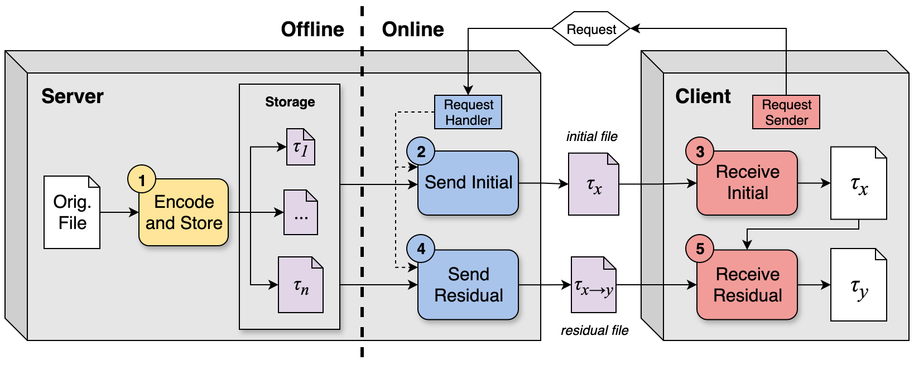

# Cortado

Cortado is a CUDA-based progressive compressor for single-precision floating point data that progresses in terms of guaranteed error bounds. This repository provides codes to measure the compression ratio and performance of each of Cortado's operations. The approach is summarized in Figure 1 below.



**Figure 1**: Overview of Cortado: First, the server encodes and stores a file at one or a few error bounds (1). When a client requests a file at an initial error bound, the server generates and sends it (2) and the client receives it (3). Subsequent client requests for finer error bounds are satisfied by computing and sending the residual between the client’s current error bound and the requested error bound (4). The client receives this residual and applies it (5). Compressed files are shaded in violet. Uncompressed files are unshaded. Tau (τ) signifies an error bound.

A full description of the approach and a comparison to state-of-the-art progressive compressors can be found in the following publication.

> Brandon Alexander Burtchell and Martin Burtscher. "Cortado: Progressive Retrieval of Lossily Compressed Data with Guaranteed Error Bounds." Proceedings of the IEEE International Conference on Cluster Computing. September 2026. [[pdf]](https://userweb.cs.txstate.edu/~burtscher/papers/cluster26a.pdf)

If you use any of the code in this repository, please cite this paper.

## Compilation

Cortado can be compiled in the following two modes depending on the use case. All executables will be output to `bin/`. To compile all executables at once, run `make all`.

> [!IMPORTANT]
> We strongly encourage specifying the [compute capability](https://developer.nvidia.com/cuda/gpus) for the target GPU with the `NVCC_ARCH` option. Without this, `nvcc` will choose a default compute capability that may ignore newer performance-improving features, produce deprecation warnings, or worst of all, fail to compile. Cortado requires compute capability >= 6.0 (`sm_60`).

```
make NVCC_ARCH=sm_xx <target>
```

### User Mode

This mode is intended for compression users. To compile, run the following command.

```
make user
```

Each executable corresponds to one of Cortado's five operations from Figure 1. Each code accepts its respective inputs. Performance reports can be enabled with `-p`/`--perf`. Compilation yields the following executables:

1. `store`: Given the original file and *n* error bounds, outputs *n* corresponding compressed files in a server storage directory
2. `init_send`: Given the server storage and request error bound, outputs the compressed initial file
3. `init_recv`: Decompresses the initial file
4. `resi_send`: Given the server storage, source error bound, and destination error bound, outputs the compressed residual file
5. `resi_recv`: Given the decompressed initial file and compressed residual file, outputs the refined, uncompressed file with the residual applied

### Benchmark Mode

This mode is intended for researchers. To compile, run the following command.

```
make benchmark
```

Each code starts from the original file and performs the full send/receive flow. Performance reports are enabled. Error bound verification can be enabled with `-v`/`--verify`. Compilation yields the following executables:

1. `store_bench`: Identical to `store` in User mode but with performance reports
2. `init_bench`: Given the original file, mocks up a stored server file and performs the full initial send/receive
3. `resi_bench`: Given the original file, mocks up the necessary inputs to perform the full residual send/receive

## Usage

Run each code with no arguments or `-h`/`--help` to see the supported arguments. In all modes, file output is off by default to encourage explicit file path definitions, hence the `-o`, `-c`, and `-d` arguments.

All codes use NOA (normalized absolute) error bounds by default. ABS (absolute) error bounds will be used instead if the `-a`/`--abs` argument is specified. In User mode, `init_send` and `resi_send` error bounds can be requested in ABS or NOA mode regardless of how the server storage was encoded, as the server's metadata (`.stor.meta`) retains enough information to make the conversion as needed.

### User Mode

Below is a minimal example of a full flow in User mode. 

```
./bin/store path/to/original_file.f32 1e-1 1e-3 1e-5 -o storage
```

```
./bin/init_send storage 1e-2 -c file.f32.init
```

```
./bin/init_recv file.f32.init -d file.f32
```

```
./bin/resi_send storage 1e-2 1e-4 -c file.f32.resi
```

```
./bin/resi_recv file.f32 file.f32.resi -d file_refined.f32
```

### Benchmark Mode

Below is an analogous example for running the three benchmark executables. Since each code starts from the original file, they can be run independently of one another.

```
./bin/store_bench path/to/original_file.f32 1e-1 1e-3 1e-5
```

```
./bin/init_bench path/to/original_file.f32 1e-3 1e-2
```

```
./bin/resi_bench path/to/original_file.f32 1e-5 1e-2 1e-4
```

## Acknowledgement

*This work has been supported by the U.S. National Science Foundation (NSF) under Award CCF-2403380, by the Department of Energy (DOE), Office of Science, Advanced Scientific Computing Research (ASCR) under Award DE-SC0022223, and by an equipment donation from NVIDIA Corporation.*
